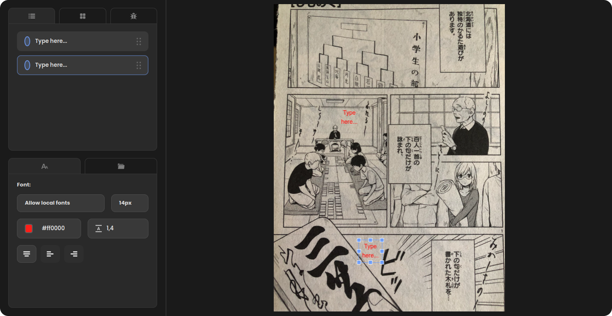

## TypeCircle Web Application



TypeCircle is a web application designed for adding text, editing, and identifying text boxes on manga images. This project is built using Angular for the frontend and Rust for the backend.

The project is also available online at [TypeCircle](http://typecircle.com). You can access the website to use the application without setting it up locally.

### Prerequisites

Before running the project, ensure you have the following dependencies installed:

- [Rust](https://www.rust-lang.org/tools/install)
- [libclang-dev](https://apt.llvm.org/)
- Node.js and npm

### Installation

1. Clone the repository:

```
git clone https://github.com/nozmer/typecircle.git

```

2. Install Angular dependencies:

```
cd typecircle
npm install

```

3. Install Rust dependencies:

```
cd backend/rust-image-service
cargo build

```

### Configuration

To configure the project for development, follow these steps:

1. Open the file `/frontend/src/config.ts`.
2. Set the `development` variable to `true` to enable development mode:

```
export const development = true;

```

### Running the Project

To start the application, run the following command:
```
npm start

```

### Usage

Once the project is running, you can access the application in your web browser at [http://localhost:4200](http://localhost:4200). The application allows you to add text, edit, and identify text boxes on manga images.

### Contributing

If you would like to contribute to this project, please fork the repository and submit a pull request with your changes. You can also open an issue to report bugs or suggest new features.

### License

This project is licensed under the MIT License - see the [LICENSE](LICENSE) file for details.